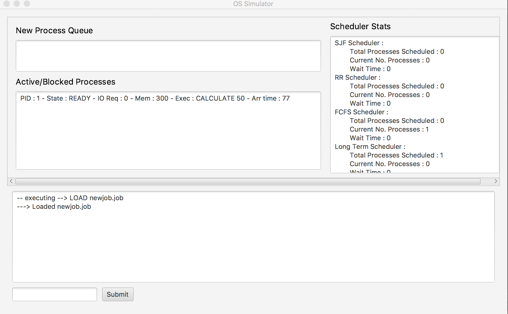

# OpSysSim

This is a simulator meant to mimic the operation of a multithreaded Operating System. There are two points of entry,
One via the JavaFX GUI accessible via the executable directory, or headless via the direct execution of the Simulator.java file. Execution of the Simulator.java file will simply execute whatever methods are called in main, currently this is just a set method with no user input. The GUI is fully interactive and is based off of a number of commands described below. 

In the OS_Simulator_executable directory is
the executable jar file along with a directory containing two ‘.job’ files and one ‘.pgrm’ file. In
addition to these there is an option as part of the command line to load randomly generated
job files via a ‘ load <number>.random ‘ command.

Programs are loaded into the simulator and immediately put into a ‘NEW’ state, after
which they scheduled by the LongTerm scheduler which either puts them into a ‘WAITING’
state if not enough memory is available to allocate the process, or they put in the ‘READY’ state
and are scheduled via the Multilevel scheduler. The Multilevel scheduler schedules a process
into one of three queues based on its estimated run time, which is calculated when the process
is loaded. A process with an estimated run time of less than 30 is scheduled Shortest Job First, a
process with a run time between 30 and 150 is placed in Round Robin scheduling. A process
with a run time greater than 150 is scheduled First Come First Serve. In addition, there is a
background mode which services first come first serve 10% of the time.

Upon first execution, the CPU initializes two primary threads which serve as the two
main cores for the OS. Each Core in turn initializes four primary core threads which are used to
service processes. Each thread can be interrupted by a device interrupt which is signaled
randomly via the InterruptHandler and lasts for a short burst of 3 to 7 cycles. A process is
placed in a CPU thread via the Dispatcher, and then proceeds for a certain amount of time
dependent on how it was scheduled and what instructions the process contains.

A process executing CALCULATE will execute for either the full calculation cycle or may
be preempted if a Device Interrupt is triggered or the process was scheduled via Round Robin,
which will only permit it to execute for an allotted amount of time.
A process executing OUT will print out the information about itself including the next
command to be executed, instruction set, and any messages which may have been passed to it
by other processes or its children.

YIELD will cause a process to either fork and create a child process, which takes over the
thread from the parent process, or if the process id is too high (arbitrary limit) it will be reenter
the READY state and allow another process to enter. Communication between parent and child
processes can be done either via message passing or a shared variable, which can be accessed
by parents, children, and grandchildren. This section is also where the critical section handling
occurs, with one bounded semaphore allocated per core.
I/O will cause a process to be placed into the ‘BLOCKED’ state and scheduled onto a first
come first serve queue which services the process for a random number between 25 and 50
cycles. Once a process has finished I/O, it is placed back in the READY state and rescheduled by
the Multilevel scheduler.

Once a process has completed execution it leaves the system, printing out some basic
information about the process as it enters the EXIT state.
